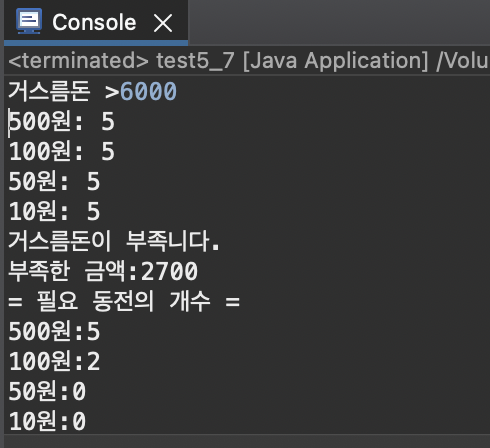
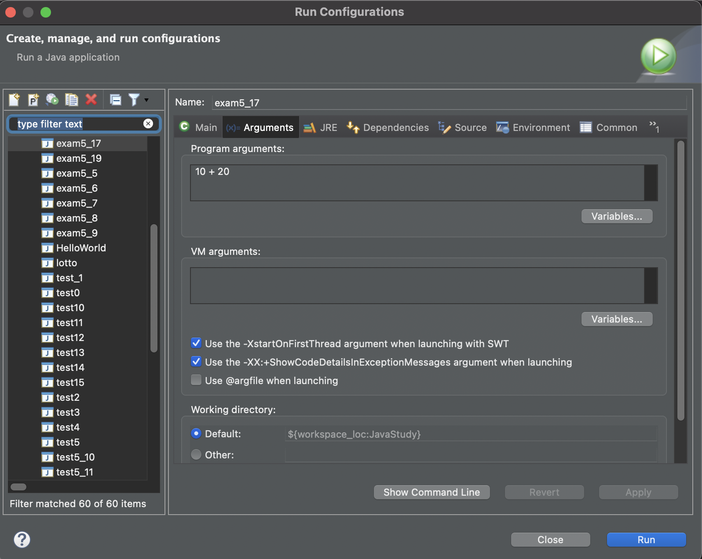

# 자바 스터디 TIL
남궁석 저 자바의 정석으로 스터디 진행 <br/>
챕터 각자 공부 후, 연습문제 풀어오기! 연습문제에 대해 같이 토론

1. [Chapter 02 변수 variable](#chapter-02-변수-variable)
2. [Chapter 04 조건문과 반복문](#chapter-04-조건문과-반복문)
3. [Chapter 05 배열 arrary](#chapter-05-배열-arrary)   
4. [Chapter 06 객체지향 프로그래밍1](#chapter-06-객체지향-프로그래밍1)


<br/>

# Chapter 02 변수 variable
 <blockquote>
- 스터디 일자: 2022.04.24(일) <br/>
- 실 공부일자: 2022.04.24(일)
 </blockquote>
<br/>

 ### 2. 스터디에서 깨달은점
 3 + '0' = '3' 숫자 + 문자는 문자 <br/>
'3' - '0' = 3  문자 - 문자는 숫자
<br/><br/><br/>

# Chapter 04 조건문과 반복문
 <blockquote>
- 스터디 일자: 2022.05.01(일) <br/>
- 실 공부일자: 2022.04.30(토) ~ 05.01(일) <br/>
- chapter 03 연산자는 각자 하고 넘어가기로 함
 </blockquote>

<br/>

### 2. 스터디에서 깨달은점

 * 자바 디버깅시 System.out 만 알고 있었는데, System.err 도 있었음! <br /> : System.err.println() 결과값이 빨간색으로 찍힘 <br/><br/>
 * 용어들! tomcat, war파일
 <br /> - tomcat : 동적인 데이터를 처리하는 웹서버, 동적인 처리를 담당하는 서버를 WAS(Web Application Server)라 하며, 대표적인 WAS가 톰캣
<br /> - war파일: WAR란 WebApplication Archive의 약자로 말그대로 웹 어플리케이션 저장소이며 웹 어플리케이션을 압축해 저장해 놓은 파일
<br /><br /> 사실 읽어봐도 뭔말인지 모르겠어... 우선은 이런게 있다는것만 알고, 넘어가자 <br/><br/>

* 연습문제에서 회문수 구하기 

```java
public class test15 {

	public static void main(String[] args) {
		// 회문수 구하기
		
		int number = 23432;
		int tmp = number;
		
		int result = 0;

		while(tmp !=0) {
			result = result*10 + tmp % 10;
			tmp /=10;
		}
		if(number == result) {
			System.out.println(number + "는 회문수입니다.");
		} else 
			System.out.println(number + "는 회문수가 아닙니다.");
	}

}
```
교재에 나와있는 답은 위의 코드인데,<br />
스터디 멤버 중에 한분은 int number를 string으로 바꾸고, 첫번째와 다섯번째, 두번째와 네번째를 비교하는 방식으로 해서 회문수인지 판별하도록 코드를 짜심! 오호 이 방식이 확실히 이해가 더 쉬움! <br/>
그분은... Character.getNumericValue() 메서드를 사용하였으나, 코드를 봤지만 정확히 기억은 안나고, 나는 아래와 같이 다시 짜봄!
```java
public class test15 {

	public static void main(String[] args) {
		// 회문수 구하기 
			
		int number = 23432;
		
		String str = String.valueOf(number);
		
		char ch0 = str.charAt(0);
		char ch1 = str.charAt(1);
		char ch2 = str.charAt(2);
		char ch3 = str.charAt(3);
		char ch4 = str.charAt(4);
		
		if(ch0 == ch4 && ch1 == ch3) {
			System.out.println(number +"는 회문수입니다.");
		} else
		System.out.println(number +"는 회문수가 아닙니다.");
	}
}
```
* Character.getNumericValue() :  char형태를 int로 변환
* String -> int 문자열을 숫자로 변환하기 위해서는  Integer.parseInt(),  Integer.valueOf() 
* int -> String 숫자를 문자열로 변환하기 위해서는  Integer.toString(),  String.valueOf(),  int + ""  
<br />

### 문자열 <-> 숫자 변환 참고: https://hianna.tistory.com/524

<br/><br/><br/>

# Chapter 05 배열 arrary
 <blockquote>
- 스터디 일자: 2022.05.08(일)<br/>
- 실 공부일자: 2022.05.05(목) ~ 08(일)
 </blockquote>
 
 <br/>

### 1. 공부내용 & 느낌점
> TIL 2022.05.05(목)~06(금)

- 배열이란? 같은 타입의 여러 변수를 하나의 묶음으로 다루는 것을 '배열(array)'라고 한다
- 배열의 선언과 생성 <br/>
배열의 선언방법과 선언 예 <br/>

|선언방법|선언예|
|----|----|
|타입[]변수이름;|int[] score;<br/>String[] name;|
|타입 변수이름[];|int score[];<br/>String name[];|

- 배열의 생성: new 연산자와 함께!<br/>
int[] score;<br/>
score = new int[5];

- 길이가 0인 배열도 생성 가능하다
- 배열이름.length 통해서 배열의 길이 알수있음!
- 배열은 한번 생성되면 길이를 변경할수가 X 따라서 배열의 길이를 넉넉하게 잡아줘야함! 그렇다고 너무 길게 잡으면 메모리 낭비함으로, 기존의 2배정도로!
- 배열 길이를 변경하는법! <br /> 1. 더 큰 배열을 새로 생성<br/>2. 기존 배열의 내용을 새로운 배열에 복사
- System.arraycopy()를 이용한 배열의 복사
<br />System.arraycopy(num, 0, newNum, 0, num.length);
<br />: num[0]에서 newNum[0]으로 num.length개의 데이터 복사
- 배열의 활용 p196~205 까지 예제문제 풀어봄 <br/>
  - 총합과 평균    
  - 최대값과 최소값   
  - 섞기(shuffle)   
  - 임의의 값으로 배열 채우기   
  - 정렬하기(sort)   
  - 빈도수 구하기   
  </br>  
- 위의 예제풀이를 바탕으로 로또번호 추출하는 코드를 짜보기!!!!
```java
import java.util.Arrays;

public class lotto {

	public static void main(String[] args) {
		// 6자리 배열 생성
		// 1~45까지 랜덤으로 가져오기
		// 중복값 없어야함
		// sort

		int[] lotto = new int[6];
		
		for(int i=0; i<lotto.length; i++) {
			lotto[i] = (int)((Math.random()*45)+1);
			
			for(int j=0; j<i; j++) {
				if(lotto[i] == lotto[j]) 
					i--;
			}	  
		}
		
		Arrays.sort(lotto);
		
		for(int i=0;i<6;i++)
			System.out.print(lotto[i] + " ");	
	}

}
```

<br/>

- String 클래스의 주요 메서드

|메서드|설명|
|-----------|-------------|
|char charAt(int index)|문자열에서 해당 위치(index)에 있는 문자를 반환|
|int length()|문자열의 길이를 반환
|String substring(int from, int to)|문자열에서 해당범위(from~to)에 있는 문자열을 반환 <br/>to는 범위에 포함되지 않음
|boolean equals(Object obj)|문자열의 내용이 obj와 같은지 확인 <br/>같으면 true, 다르면 flase
|char[]toCharArray()|문자열을 문자배열(char[])로 변환해서 반환


- 다차원 배열

|선언방법|선언예|
|----|----|
|타입[]변수이름;|int[] score;<br/>String[] name;|
|타입 변수이름[];|int score[];<br/>String name[];|

- 2차원 배열의 총합, 평균 구하기 코드
```java
public class test5_4 {

	public static void main(String[] args) {
		// 2차원 배열 arr에 담긴 모든 값의 총합과 평균을 구하는 프로그램을 완성
		
		int[][] arr = {
				{5,5,5,5,5},
				{10,10,10,10,10},
				{20,20,20,20,20},
				{30,30,30,30,30}
		};
		
		int total = 0;
		int length = 0;
		float average =0;
		
		for(int i=0; i<arr.length; i++) {
			for(int j=0; j< arr[i].length; j++) {
				total += arr[i][j];
			}
		length += arr[i].length;
         // average = total/(float)(arr.length * arr[i].length);	
		 // 모든 값의 평균이니까 arr.length * arr[i].length 로 계산으로 처음에는 했는데,
		 // 이러면은 배열이 가변배열일때 계산이 안맞아서 길이 변경함
		 
		 average = total/(float)(length);	
		 
		}
		System.out.println("length="+length);
		System.out.println("total="+total);
		System.out.println("average="+average);
	}

}
```
- 챕터 연습문제 1~5까지 품, 위의 코드는 연습문제4번! 근디 교재의 답이라는 다르게 풀이함
<br/><br/>
> TIL 2022.05.07(토)
* 연습문제 6~8까지 품, 아니 3문제 푸는데 왜케 오래걸리지,좀 더 응용해서 풀려고 했지만! 그 중에 하나 연습문제 7번 응용한 코드    
거스름돈 입력받아서 어떻게 동전을 주면 되는지에 대한 코드
```java
import java.util.Scanner;

public class test5_7 {

	public static void main(String[] args) {
		
		Scanner scanner = new Scanner(System.in);
		
		System.out.print("거스름돈 >");
		String input = scanner.nextLine();
		int money = Integer.parseInt(input);
		
		if(money < 0) {
			System.exit(0);
		} 
		
		int[] coinUnit = {500, 100, 50, 10};
		int[] coin = {5, 5, 5, 5}; 
		
		for(int i=0; i<coinUnit.length; i++) {
			int coinNum =0;
			
			coinNum = money/coinUnit[i];
			
			if(coin[i] >= coinNum) {
				coin[i] -=coinNum; // coin[i]가 남는 동전의 개
			} else {
				coinNum = coin[i];
				coin[i] = 0; // coin[i]가 남는 동전의 개
			}
			
//			money = money - (coinNum*coinUnit[i]);
			money -= coinNum*coinUnit[i];
	
			
			System.out.println(coinUnit[i]+"원: "+coinNum);

		}
		if(money > 0) {
			System.out.println("거스름돈이 부족니다.");
			System.out.println("부족한 금액:"+ money);
			System.out.println("= 필요 동전의 개수 =");
			
			for(int i = 0; i < coinUnit.length; i++) {
				System.out.println(coinUnit[i]+"원:"+ money/coinUnit[i]);
				money = money%coinUnit[i];
			}
			
			System.exit(0);
		}
		System.out.println("= 남은 동전의 개수 =");
		
		for(int i = 0; i < coinUnit.length; i++) {
			System.out.println(coinUnit[i]+"원:" +coin[i]);
		}
				
	}

}
```
출력예

</img> 
</img>

<br/><br/>

> TIL 2022.05.08(일)
* to do list 연습문제 9~13까지 풀기 ✔️
* 커맨드라인 입력 : 이클립스 실행 시 매개값 주어 실행하는 방법   
Run -> Run Confiaurations -> Arguments 에서 매개값 입력    
</img>   
</img>
<br/><br/>
```java
public class exam5_17 {

	public static void main(String[] args) {
		// 커맨드라인을 통해 입력
		
		if(args.length !=3) {
			System.out.print("usage: exam5_17 NUM1 OP NUM2");
			System.exit(0);
		}
		int num1 = Integer.parseInt(args[0]);
		char op = args[1].charAt(0);
		int num2 = Integer.parseInt(args[2]);
		int result = 0;
		
		switch(op) {
			case '+' :
				result = num1 + num2;
				break;
			case '-' :
				result = num1 - num2;
				break;
			case 'x':
				result = num1 * num2;
				break;
			case '/':
				result = num1 / num2;
				break;
			default: 
				System.out.println("지원되지 않는 연산니다.");
		}
		System.out.println("결과:"+result);

	}
```
위의 코드를 Run Confiaurations에서 10 + 20 를 매개값으로 넣으면 결과:30이 출력

<br /><br /><br />
### 2. 스터디에서 깨달은점

char배열에서 String으로 변환이 아직 헷갈림 
char[] chArr = {'A','B','C'};   
String str = new String(chArr); // char배열 -> String   
System.out.println(str);  // ABC   

char[] tmp = str.toCharArray(); // String -> char배열   
System.out.println(tmp[0]); //A

String[] stringArray = {str};   
System.out.println(stringArray[0]); //ABC

# Chapter 06 객체지향 프로그래밍1
 <blockquote>
- 스터디 일자: 2022.05.15(일)<br/>
- 실 공부일자: 2022.05.09(월) ~ 
</blockquote>    
<br />

### 1. 공부내용 & 느낌점
> TIL 2022.05.09(월)

* 객체지향이론의 기본개념은 '실제 세계는 사물(객체)로 이루어져 있으며, 발생하는 모든 사건들은 사물간의 상호작용이다' 라는 것.
실제 사물의 속성과 기능을 분석한 다음, 데이터(변수)와 함수로 정의함으로써 실제 세계를 컴퓨터 속에 옮겨 놓은 것과 같음

* 객체지향이론은 상속, 캡슐화, 추상화 개념을 중심으로 구체적으로 발전
* 객체지향언의 특징    
1. 코드의 재사용이 높고, 2. 코드의 관리가 용이, 3. 신뢰성 높은 프로그램 가능
* 클래스는 객체의 설계도, 객체는 실제로 존재하는것(무형, 유형) ex) 클래스 TV설계도, 객체 TV
* 클래스로부터 객체를 만드는 과정을 클래스의 인스턴스화(instantiate)라고 하고, 어떤 클래스로부터 만들어진 객체를 그 클래스의 인스턴스(instance)라고 한다.
* 객체는 속성과 기능으로 구성됨, 속성과 기능을 그 객체의 멤버(구성원, member)라고 한다.

|||
|----|----|
|속성(property)|멤버변수(member variable)✔️, 특성(attribute), 필드(field), 상태(state)|
|기능(function);|메서드(method)✔️, 함수(function), 행위(behavior)|
* 클래스를 선언한 것은 설계도를 작성한것에 불과, 인스턴스를 생성해야 객체를 사용할수 있음,
* 클래스로부터 인스턴스 생성하는 방법   
클래스명 변수명; // 클래스의 객체를 참조하기 위한 참조변수 선언   
변수명 = new 클래스명(); //클래스의 객채를 생성후, 객체의 주소에 참조변수 저장

```java

class Tv{
	// Tv의 속성(멤버변수)
	String color; // 색상
	boolean power; // 전원상태(on/off)
	int channel; // 채널 
	
	//Tv의 기능(메서드)	
	void power() {power = !power;}   // TV를 켜거나 끄는 기능을 하는 메서드 
	void channelUp() { ++channel; }  // TV의 채널을 높이는 기능을 하는 메서드 
	void channelDown() { --channel;} // TV의 채널을 낮추는 기능을 하는 메서드 
}

public class exam6_1 {

	public static void main(String[] args) {
		
		Tv t;            // 1. Tv인스턴스를 참조하기 위한 변수 t를 선언 
		t = new Tv();    // 2. Tv인스턴스를 생성
		t.channel = 7;   // 3. Tv인스턴스의 멤버변수는 channel 7로 
		t.channelDown(); // 4. Tv인스턴스의 메서드 channelDown()를 호출
		System.out.println("현재 채널은 " + t.channel + "입니다.");
	}

}

```
코드에 색깔이 이상하게 입혀지네, 무튼
1. Tv t;   
Tv클래스 타입의 참조변수 t선언, 메모리에 참조변수 t를 위한 공간이 마련, 아직 인스턴스 생성되지 않았으므로 참조변수로 아무것도 할수 없음
2. t = new Tv();   
연산자 new에 의해 Tv클래스의 인스턴스가 메모리의 빈 공간에 생성.
이 떄, 멤버변수는 각 자료형의 해당하는 기본값으로 초기화됨
(color는 참조형이므로 null, power는 boolean이므로 false, channel은 int이므로 0으로)
그 다음 대입연산자(=)에 의해 생성된 객체의 주소값이 참조변수 t에 저장! 이제는 참조변수 t를 통해 Tv인스턴스에 접근할 수 있음, 인스턴스를 다루기 위해서는 참조변수가 반드시 필요!   
Tv t;   
t = new Tv(); 
두 문장을 Tv t = new Tv(); 한 문장으로 가능

3. t.channel = 7;   
참조변수 t에 저장된 주소에 있는 인스턴스의 멤버변수 channel에 7을 저장한다. 인스턴스의 멤버변수(속성)을 사용하려면 참조변수.멤버변수(t.channel) 와 같이 사용
4. t.channelDown();    
참조변수 t가 참조하고 있는 Tv인스턴스의 channelDown메서드 호출
<br/><br/>

* 인스턴스는 참조변수를 통해서만 다룰 수 있으며, 참조변수의 타입은 인스턴스의 타입과 일치해야 한다! 
* 인스턴스 두개가 같은 클래스로부터 생성되었을지라도, 각 인스턴스의 속성(멤버변수)은 서로 다른값으 유지 가능, 메서드의 내용은 모든 인스턴스에 대해 동일함
* 자신을 참조하고 있는 참조변수 하나도 없는 인스턴스는 더 이상 사용되어질 수 없으므로 '가비지 컬렉터(Garbage Collector)에 의해 자동적으로 메모리에서 제거된다.
* 참조변수에는 하나의 값(주소)만이 저장될 수 있으므로 둘 이상의 참조변수 하나의 인스턴스를 가리키는(참조하는) 것은 가능하지만 하나의 참조변수로 여러 개의 인스턴스를 가리키는 것은 불가능


<br/> 

### 2. 스터디에서 깨달은점
 <br/>


