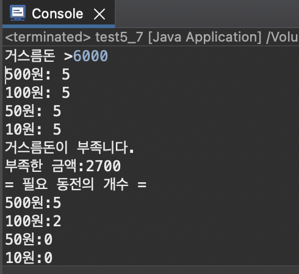
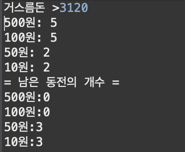
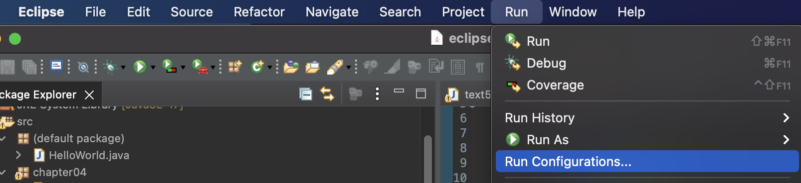
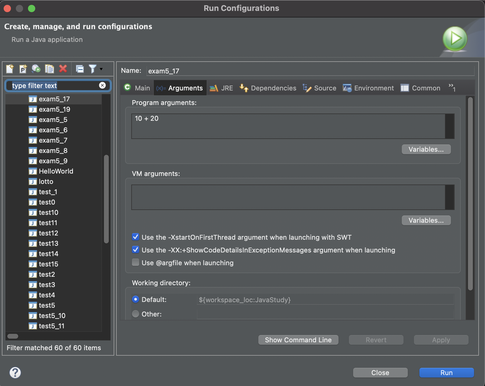

# Chapter 05 배열 arrary
 <blockquote>
- 스터디 일자: 2022.05.08(일)<br/>
- 실 공부일자: 2022.05.05(목) ~ 08(일)
 </blockquote>
 
 <br/>

### 1. 공부내용 & 느낌점
> TIL 2022.05.05(목)~06(금)

- 배열이란? 같은 타입의 여러 변수를 하나의 묶음으로 다루는 것을 '배열(array)'라고 한다
- 배열의 선언과 생성 <br/>
배열의 선언방법과 선언 예 <br/>

|선언방법|선언예|
|----|----|
|타입[]변수이름;|int[] score;<br/>String[] name;|
|타입 변수이름[];|int score[];<br/>String name[];|

- 배열의 생성: new 연산자와 함께!<br/>
int[] score;<br/>
score = new int[5];

- 길이가 0인 배열도 생성 가능하다
- 배열이름.length 통해서 배열의 길이 알수있음!
- 배열은 한번 생성되면 길이를 변경할수가 X 따라서 배열의 길이를 넉넉하게 잡아줘야함! 그렇다고 너무 길게 잡으면 메모리 낭비함으로, 기존의 2배정도로!
- 배열 길이를 변경하는법! <br /> 1. 더 큰 배열을 새로 생성<br/>2. 기존 배열의 내용을 새로운 배열에 복사
- System.arraycopy()를 이용한 배열의 복사
<br />System.arraycopy(num, 0, newNum, 0, num.length);
<br />: num[0]에서 newNum[0]으로 num.length개의 데이터 복사
- 배열의 활용 p196~205 까지 예제문제 풀어봄 <br/>
  - 총합과 평균    
  - 최대값과 최소값   
  - 섞기(shuffle)   
  - 임의의 값으로 배열 채우기   
  - 정렬하기(sort)   
  - 빈도수 구하기   
  </br>  
- 위의 예제풀이를 바탕으로 로또번호 추출하는 코드를 짜보기!!!!
```java
import java.util.Arrays;

public class lotto {

	public static void main(String[] args) {
		// 6자리 배열 생성
		// 1~45까지 랜덤으로 가져오기
		// 중복값 없어야함
		// sort

		int[] lotto = new int[6];
		
		for(int i=0; i<lotto.length; i++) {
			lotto[i] = (int)((Math.random()*45)+1);
			
			for(int j=0; j<i; j++) {
				if(lotto[i] == lotto[j]) 
					i--;
			}	  
		}
		
		Arrays.sort(lotto);
		
		for(int i=0;i<6;i++)
			System.out.print(lotto[i] + " ");	
	}

}
```

<br/>

- String 클래스의 주요 메서드

|메서드|설명|
|-----------|-------------|
|char charAt(int index)|문자열에서 해당 위치(index)에 있는 문자를 반환|
|int length()|문자열의 길이를 반환
|String substring(int from, int to)|문자열에서 해당범위(from~to)에 있는 문자열을 반환 <br/>to는 범위에 포함되지 않음
|boolean equals(Object obj)|문자열의 내용이 obj와 같은지 확인 <br/>같으면 true, 다르면 flase
|char[]toCharArray()|문자열을 문자배열(char[])로 변환해서 반환


- 다차원 배열

|선언방법|선언예|
|----|----|
|타입[]변수이름;|int[] score;<br/>String[] name;|
|타입 변수이름[];|int score[];<br/>String name[];|

- 2차원 배열의 총합, 평균 구하기 코드
```java
public class test5_4 {

	public static void main(String[] args) {
		// 2차원 배열 arr에 담긴 모든 값의 총합과 평균을 구하는 프로그램을 완성
		
		int[][] arr = {
				{5,5,5,5,5},
				{10,10,10,10,10},
				{20,20,20,20,20},
				{30,30,30,30,30}
		};
		
		int total = 0;
		int length = 0;
		float average =0;
		
		for(int i=0; i<arr.length; i++) {
			for(int j=0; j< arr[i].length; j++) {
				total += arr[i][j];
			}
		length += arr[i].length;
         // average = total/(float)(arr.length * arr[i].length);	
		 // 모든 값의 평균이니까 arr.length * arr[i].length 로 계산으로 처음에는 했는데,
		 // 이러면은 배열이 가변배열일때 계산이 안맞아서 길이 변경함
		 
		 average = total/(float)(length);	
		 
		}
		System.out.println("length="+length);
		System.out.println("total="+total);
		System.out.println("average="+average);
	}

}
```
- 챕터 연습문제 1~5까지 품, 위의 코드는 연습문제4번! 근디 교재의 답이라는 다르게 풀이함
<br/><br/>
> TIL 2022.05.07(토)
* 연습문제 6~8까지 품, 아니 3문제 푸는데 왜케 오래걸리지,좀 더 응용해서 풀려고 했지만! 그 중에 하나 연습문제 7번 응용한 코드    
거스름돈 입력받아서 어떻게 동전을 주면 되는지에 대한 코드
```java
import java.util.Scanner;

public class test5_7 {

	public static void main(String[] args) {
		
		Scanner scanner = new Scanner(System.in);
		
		System.out.print("거스름돈 >");
		String input = scanner.nextLine();
		int money = Integer.parseInt(input);
		
		if(money < 0) {
			System.exit(0);
		} 
		
		int[] coinUnit = {500, 100, 50, 10};
		int[] coin = {5, 5, 5, 5}; 
		
		for(int i=0; i<coinUnit.length; i++) {
			int coinNum =0;
			
			coinNum = money/coinUnit[i];
			
			if(coin[i] >= coinNum) {
				coin[i] -=coinNum; // coin[i]가 남는 동전의 개
			} else {
				coinNum = coin[i];
				coin[i] = 0; // coin[i]가 남는 동전의 개
			}
			
//			money = money - (coinNum*coinUnit[i]);
			money -= coinNum*coinUnit[i];
	
			
			System.out.println(coinUnit[i]+"원: "+coinNum);

		}
		if(money > 0) {
			System.out.println("거스름돈이 부족니다.");
			System.out.println("부족한 금액:"+ money);
			System.out.println("= 필요 동전의 개수 =");
			
			for(int i = 0; i < coinUnit.length; i++) {
				System.out.println(coinUnit[i]+"원:"+ money/coinUnit[i]);
				money = money%coinUnit[i];
			}
			
			System.exit(0);
		}
		System.out.println("= 남은 동전의 개수 =");
		
		for(int i = 0; i < coinUnit.length; i++) {
			System.out.println(coinUnit[i]+"원:" +coin[i]);
		}
				
	}

}
```
출력예

</img> 
</img>

<br/><br/>

> TIL 2022.05.08(일)
* to do list 연습문제 9~13까지 풀기 ✔️
* 커맨드라인 입력 : 이클립스 실행 시 매개값 주어 실행하는 방법   
Run -> Run Confiaurations -> Arguments 에서 매개값 입력    
</img>   
</img>
<br/><br/>
```java
public class exam5_17 {

	public static void main(String[] args) {
		// 커맨드라인을 통해 입력
		
		if(args.length !=3) {
			System.out.print("usage: exam5_17 NUM1 OP NUM2");
			System.exit(0);
		}
		int num1 = Integer.parseInt(args[0]);
		char op = args[1].charAt(0);
		int num2 = Integer.parseInt(args[2]);
		int result = 0;
		
		switch(op) {
			case '+' :
				result = num1 + num2;
				break;
			case '-' :
				result = num1 - num2;
				break;
			case 'x':
				result = num1 * num2;
				break;
			case '/':
				result = num1 / num2;
				break;
			default: 
				System.out.println("지원되지 않는 연산니다.");
		}
		System.out.println("결과:"+result);

	}
```
위의 코드를 Run Confiaurations에서 10 + 20 를 매개값으로 넣으면 결과:30이 출력

<br /><br /><br />
### 2. 스터디에서 깨달은점

char배열에서 String으로 변환이 아직 헷갈림 
char[] chArr = {'A','B','C'};   
String str = new String(chArr); // char배열 -> String   
System.out.println(str);  // ABC   

char[] tmp = str.toCharArray(); // String -> char배열   
System.out.println(tmp[0]); //A

String[] stringArray = {str};   
System.out.println(stringArray[0]); //ABC