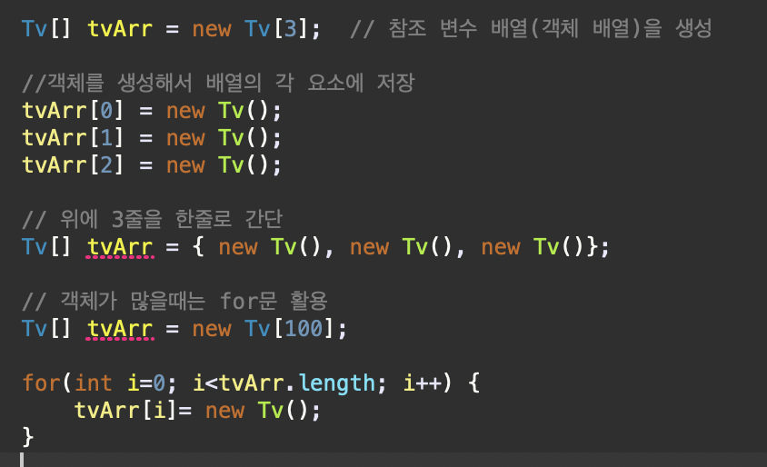
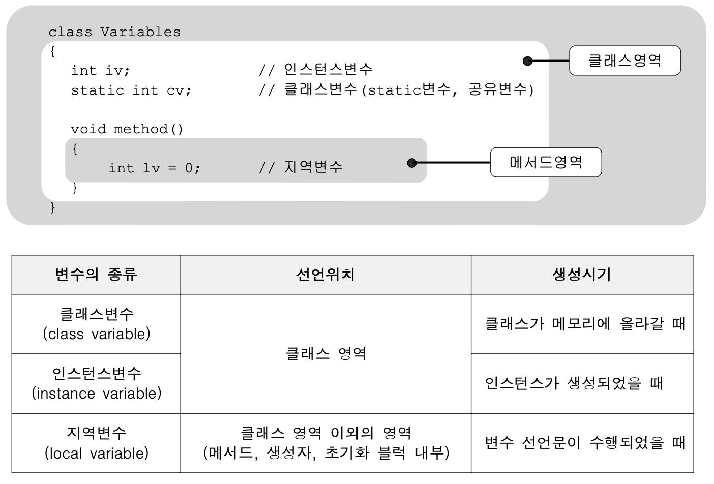

# Chapter 06 객체지향 프로그래밍1
 <blockquote>
- 스터디 일자: 2022.05.15(일)<br/>
- 실 공부일자: 2022.05.09(월) ~ 
</blockquote>   
<br />

### 1. 공부내용 & 느낌점
> TIL 2022.05.09(월)

* 객체지향이론의 기본개념은 '실제 세계는 사물(객체)로 이루어져 있으며, 발생하는 모든 사건들은 사물간의 상호작용이다' 라는 것.
실제 사물의 속성과 기능을 분석한 다음, 데이터(변수)와 함수로 정의함으로써 실제 세계를 컴퓨터 속에 옮겨 놓은 것과 같음

* 객체지향이론은 상속, 캡슐화, 추상화 개념을 중심으로 구체적으로 발전
* 객체지향언의 특징    
1. 코드의 재사용이 높고, 2. 코드의 관리가 용이, 3. 신뢰성 높은 프로그램 가능
* 클래스는 객체의 설계도, 객체는 실제로 존재하는것(무형, 유형) ex) 클래스 TV설계도, 객체 TV
* 클래스로부터 객체를 만드는 과정을 클래스의 인스턴스화(instantiate)라고 하고, 어떤 클래스로부터 만들어진 객체를 그 클래스의 인스턴스(instance)라고 한다.
* 객체는 속성과 기능으로 구성됨, 속성과 기능을 그 객체의 멤버(구성원, member)라고 한다.

|||
|----|----|
|속성(property)|멤버변수(member variable)✔️, 특성(attribute), 필드(field), 상태(state)|
|기능(function);|메서드(method)✔️, 함수(function), 행위(behavior)|
* 클래스를 선언한 것은 설계도를 작성한것에 불과, 인스턴스를 생성해야 객체를 사용할수 있음,
* 클래스로부터 인스턴스 생성하는 방법   
클래스명 변수명; // 클래스의 객체를 참조하기 위한 참조변수 선언   
변수명 = new 클래스명(); //클래스의 객채를 생성후, 객체의 주소에 참조변수 저장

```java

class Tv{
	// Tv의 속성(멤버변수)
	String color; // 색상
	boolean power; // 전원상태(on/off)
	int channel; // 채널 
	
	//Tv의 기능(메서드)	
	void power() {power = !power;}   // TV를 켜거나 끄는 기능을 하는 메서드 
	void channelUp() { ++channel; }  // TV의 채널을 높이는 기능을 하는 메서드 
	void channelDown() { --channel;} // TV의 채널을 낮추는 기능을 하는 메서드 
}

public class exam6_1 {

	public static void main(String[] args) {
		
		Tv t;            // 1. Tv인스턴스를 참조하기 위한 변수 t를 선언 
		t = new Tv();    // 2. Tv인스턴스를 생성
		t.channel = 7;   // 3. Tv인스턴스의 멤버변수는 channel 7로 
		t.channelDown(); // 4. Tv인스턴스의 메서드 channelDown()를 호출
		System.out.println("현재 채널은 " + t.channel + "입니다.");
	}

}

```
코드에 색깔이 이상하게 입혀지네, 무튼
1. Tv t;   
Tv클래스 타입의 참조변수 t선언, 메모리에 참조변수 t를 위한 공간이 마련, 아직 인스턴스 생성되지 않았으므로 참조변수로 아무것도 할수 없음
2. t = new Tv();   
연산자 new에 의해 Tv클래스의 인스턴스가 메모리의 빈 공간에 생성.
이 떄, 멤버변수는 각 자료형의 해당하는 기본값으로 초기화됨
(color는 참조형이므로 null, power는 boolean이므로 false, channel은 int이므로 0으로)
그 다음 대입연산자(=)에 의해 생성된 객체의 주소값이 참조변수 t에 저장! 이제는 참조변수 t를 통해 Tv인스턴스에 접근할 수 있음, 인스턴스를 다루기 위해서는 참조변수가 반드시 필요!   
Tv t;   
t = new Tv(); 
두 문장을 Tv t = new Tv(); 한 문장으로 가능

3. t.channel = 7;   
참조변수 t에 저장된 주소에 있는 인스턴스의 멤버변수 channel에 7을 저장한다. 인스턴스의 멤버변수(속성)을 사용하려면 참조변수.멤버변수(t.channel) 와 같이 사용
4. t.channelDown();    
참조변수 t가 참조하고 있는 Tv인스턴스의 channelDown메서드 호출
<br/><br/>

* 인스턴스는 참조변수를 통해서만 다룰 수 있으며, 참조변수의 타입은 인스턴스의 타입과 일치해야 한다! 
* 인스턴스 두개가 같은 클래스로부터 생성되었을지라도, 각 인스턴스의 속성(멤버변수)은 서로 다른값으 유지 가능, 메서드의 내용은 모든 인스턴스에 대해 동일함
* 자신을 참조하고 있는 참조변수 하나도 없는 인스턴스는 더 이상 사용되어질 수 없으므로 '가비지 컬렉터(Garbage Collector)에 의해 자동적으로 메모리에서 제거된다.
* 참조변수에는 하나의 값(주소)만이 저장될 수 있으므로 둘 이상의 참조변수 하나의 인스턴스를 가리키는(참조하는) 것은 가능하지만 하나의 참조변수로 여러 개의 인스턴스를 가리키는 것은 불가능


<br/> 

> TIL 2022.05.10(화)
* 객체 배열이란? 객체의 배열, 객체 배열 안에 객체가 저장 되는게 아니고, 객체의 주소가 저장됨!<br />사실 객체 별은은 참조 변수들을 하나로 묶은 참조 변수 배열인 것.   
: 많은 수의 객체를 다뤄야 할 떄, 다양한 타입의 데이타를 객체 배열을 통해 저장할 때 사용
* Tv[] tvArr = new Tv[3]; => 그저 객체를 다루기 위한 참조변수 3개만 생성된거지, 객체가 저장된거는 아님!!! 객체 생성해서 객체 배열의 각 요소에 저장해 줘야함

</img> 

* Private와 Public 차이
Private 멤버는 class 외부에서 접근할 수 없는 변수를,
Public 멤버는 class 외부에서 접근 할 수 있는 변수를 의미
Private 변수에 값을 대입하기 위해서는 public으로 제공하는 SET 함수를 사용하는 방식으로 해야함!
```java
public class Time {
	
	private int hour;
	private int minute;
	private float second;
	
	public int getHour() { return hour; }
	public int getMinute() { return minute; }
	public float getSecond() { return second; }
	
	
	public void setHour(int h) {
		if(h < 0 || h > 23) return;
		hour = h;	
	}
	public void setMinute(int m) {
		if(m < 0 || m > 59) return;
		minute = m;	
	}
	public void setSecond(float s) {
		if(s < 0 || s > 23) return;
		second = s;	
	}
}

```

> TIL 2022.05.12(목)

* 자바의 정석 p246 ~  P277
* 변수와 메서드   
-선언위치에 따른 변수의 종류  
-클래스변수와 인스변수변수   
-메서드   
-메서드의 선언과 구현, 호출   
-return문   
-JVM의 메모리 구조    
-기본형 매개변수와 참조형 매개변수   
-참조형 반환타입
-재귀호출

> TIL 2022.05.14(토)
* 자바의 정석  p277~ 307 
-클래스 메서드(static메서드)와 인스턴스 메서드   
-클래스 멤버와 인스턴스 멤버간의 참조와 호출   
인스턴스 멤버(변수와 메서드)는 클래스 멤버 호출가능하지만   
클래스(static)멤버는 인스턴스 멤버를 호출 할수 없음!
why? 인스턴스 멤버가 존재하는 시점에, 클래스멤버가 존재하는 시점에 인스턴스 멤버가 존재하지 않을 수도 있기 때문이다.

```java
	class MemberCall {
		int iv = 10;
		static int cv = 20;
		
		int iv2 = cv; 
//		static int cv2 = iv;  //에러 클래스변수(static)는 인스변수를 사용할수 없음
		static int cv2 = new MemberCall().iv; // 이처럼 객채를 생성해서 사용가능.
	}

```
* 실제로 같은 클래스 내에서 클래스멤버가 인스턴스멤버를 참조 또는 호출해야 하는 경우는 드뭄, 그런 경우라면 인스턴스 매서드로 작성해야 할 메서드를 클래스 매서드로 한것은 아닌지 확인!

* 오버로딩   
메서드도 변수와 마찬가지로 같은 클래스 내에서 서로 구별가능해야함!각자 다른 이름을 가져야한다 자바에서는 한 클래스 내에 이미 사용하려는 이름과 같은 이름을 가진 메서드가 있더라도 매개변수의 개수 또는 타입이 다르면, 같은 이름을 사용해서 메서드를 정의할 수 있다!!
: 한 클래스 내에서 같은 이름의 매서드를 여러 개 정의 하는것을 '메서드 오버로딩!' 줄여서 '오버로딩'이라고 한다.

* 오버로딩 조건
```
1. 메서드의 이름이 같아야 한다.
2. 매개변수의 개수 또는 타입이 달라야 한다.
``` 
➡️ 조건이 만족되지 않으면, 메서드 중복으로 간주되어, 컴파일 시 에러 발생   
ex) printIn 메서드

* 가변인자와 오버로딩   
기존에는 메서드의 매개변수 개수가 고정적이었으나 JDK1.5부터 동적으로 지정해 줄 수 있게 되었으며, 이 기능을 '가변인자'

* 생성자
생성자는 인스턴스 생성될 때 호출되는 '인스턴스 초기화 매서드'이다. 따라서 인스턴스 변수의 초기화 작업에 주로 사용되며, 인스턴스 생성 시에 실행되어야 할 작업을 위해서도 사용된다.
```
1. 생성자의 이름은 클래스의 이름과 같아야 한다.
2. 생성자는 리턴 값이 없다. (그렇다고 void를 붙이지는 않음)
```
```
Card c = new Card();

1. 연산자 new에 의해서 메모리(heap)에 Card클래ㅐ스의 인스턴스가 생성된다.
2. 생성자 Card()가 호출되어 수행된다.
3. 연산자 new의 결과로, 생성된 Card인스턴스의 주소가 반환되어 참조변수 c에 저장된다.
```
* 지금까지 클래스에 생성자를 정의하지 않고도 인스턴스를 생성할 수 있었던 이유는 컴파일러가 제공하는 '기본 생성자' 덕분이었다.
* 기본 생성자가 컴파일에 의해서 추가되는 경우는 클래스에 정의된 생성자가 하나도 없을 때 뿐이다.
* 매개변수가 있는 생성자
* 생성자에서 다른 생성자 호출 - this(), this   
: 같은 클래스의 맴버들 간에 서로 호출할 수 있는 것처럼 생성자 간에도 서로 호출이 가능하다. 단 아래 조건 충족해야함!
```
- 생성자의 이름으로 클래스 이름 대신 this를 사용한다.
- 한 생성자에서 다른 생성자를 호출할 떄는 반드시 첫 줄에만 호출이 가능하다.
```
* 생성자를 이용한 인스턴스의 복사
* 변수의 초기화   
멤버변수와 배열의 초기화는 선택, 지연 변수는 사용하기 전에 반드시 초기화해야한다.
```
멤버변수의 초기화 방법   
1. 명시적 초기화
2. 생성자
3. 초기화 블럭
-인스턴스 초기화 블럭: 인스턴스변수를 초기화 하는데 사용
-클래스 초기화 블럭: 클래스변수를 초기화 하는데 사용
```
1. 명시적 초기화: 변수를 선언과 동시에 초기화 하는것
3. 초기화 블럭   
-인스턴스 초기화 블럭: 단순히 클래스 내에 블럭{}만들고, 그 안에 코드 작성하면 됨
-클래스 초기화 블럭: 인스턴스 초기화 블럭 앞에 단순히 static붙이면 된다
생성자보다 인스턴스 초기화 블럭이 먼저 수행됨

* 멤버변수의 초기화 시기와 순서
```
클래스변수의 초기화 시점: 클래스가 처음 로딩될떄 단 한번 초기화된다.
인스턴스변수의 초기화 시점: 인스턴스가 생성될때마가 각 인스턴스별로 초기화됨.

클래스변수의 초기화순서: 기본값 -> 명시적초기화 -> 클래스 초기화 블럭
인스턴스변수의 초기화순서: 기본값 -> 명시적초기화 -> 인스턴스 초기화 블럭 -> 생성자
```


> TIL 2022.05.15(일)  

* 연습문제 Chapter6 1~24번 문제
```
4번 문제
소수점 2번째 자리수에서 반올림하기
236/3 →78
236 / 3f → 78.666664
236 / 3f * 10 → 786.66664
236 / 3f * 10 + 0.5(반올림이니까) → 787.16664
(int)(236 / 3f * 10 + 0.5) → (int)787.16664 → 787 
(int)(236 / 3f * 10 + 0.5) / 10 → 78
(int)(236 / 3f * 10 + 0.5) / 10f → 78.7


```

```
6번 문제   
Math.sqrt: 제곱근 계산 ex) Math.sqrt(double a)
Math.pow: 제곱 계산 ex) Math.pow(double a, double b)
```

```
8번 문제
코드에 정의된 변수들 종류별로 구분하시오

public class PlayingCard {
	
	int kind;
	int num;
	
	static int width;
	static int height;
	
	PlayingCard (int k, int n){
		kind = k;
		num = n;
	}

	public static void main(String[] args) {
		PlayingCard card = new PlayingCard(1,1);
	}
}

- 클래스변수(static변수) : width, height 
- 인스턴스변수 : kind, num
- 지역변수 : k, n, card, args

```

</img> 

```
19번 다음 코드의 실행 결과를 예측하여 적으시오.

public class test19 {

	public static void change(String str) {
		str += "456";
	}
	
	public static void main(String[] args) {
		
		String str = "ABC123"; 
		System.out.println(str);
		change(str);
		System.out.println("After change:"+str);
	}
}

실행결과: 
ABC123
After change:ABC123

문자열은 내용을 변경할 수 없기 때문에 덧셈연산을 하면 새로운 문자열이 생성되고, 
새로운 문자열의 주소가 변수 str에 저장된다. 
change메서드는 종료되고, 작업에 사용하던 메모리를 반환하므로 change메서드의 지역변수인 str역시 메모리에서 제거된다. 
다시 main메서드로 돌아와서 문자열 str의 값을 출력하면 처음의 값과 변함없는 값이 출력된다
```


### 2. 스터디에서 깨달은점

* oop 개념, 다음 Chapter7에서 배울 내용이지만, 살짝 무엇의 약자이고, 
  한분이 면접때 이거 질문 받았었다고 함   
  Object-Oriented Programming, 객체 지향 프로그래밍

* 자바와 자바스크립트에서의 this 차이에 대해 애기   
  자바에서 this는 그 객체 자신을 가리키는 참조변수
  자바스크립트 안에서는 function 안에서 this가 쓰이면, 안의 객체를 바라본다?
  function 밖에서 쓰이면은 this는 window객체를 바라본다. 
  function scope영역 도 애기하면서, 설명해주셨는데, 메모해 놓은게 두서가 없어서, 글로 풀라고 하니 어렵네

* java 버전 관련
지금은 java 8 또는 11 정도를 쓰고,
6,7 에서 -> 8로 오면서 람다가 생기고, class가 많아지고, 스타일이 바뀐것 같다고 했음   
class는 정확히 어떤거를 말했던 거지

* class 역활 단위로 쪼개기 때문에, 연습문제 4번( 혹은 다른 연습도 그런데 ) class student 이렇게 한 파일에 쓰는 경우가 없데
( 책은 쉽게 보여주기 위해서 그런듯 )
생성자 생성될때 class를 import 하는 방식

* 초기화 블록 -> 많이 안 씀, 명시적으로 초기화함

* Math.abs(); 절대값 반환, java, js 다 있음

* 뷰어, 코더, 프로그래머 대해 애기   
스터디 멤버중에 입사한지 얼마 안되신 분이 있는데, 회사사람들이랑 애기할 떄 본인은 아직 뷰어라고 애기했다고ㅋㅋ 그러면서 경력직 한분이 코더는 코드를 서치해서 가져온 거에 그치지 않고, 리팩토링 하거나 하면 코더 정도 될것 같다고, 은근 환경변수 설정 못하는 개발자들도 많다고함
 <br/>