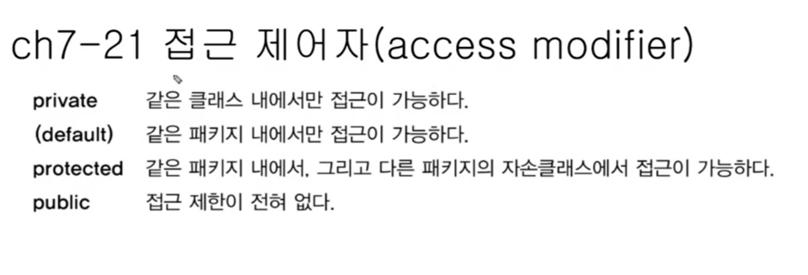

# Chapter 07 객체지향 프로그래밍2
 <blockquote>
- 스터디 일자: 2022.05.21(토)<br/>
- 실 공부일자: 2022.05.16(월) ~ 2022.05.21(토)
</blockquote>   
<br />

> TIL 2022.05.16~18(월~수)
* OOP
* 클래스와의 관계( 상속, 포함 )
* 단일 상속, 하나 이상의 클래스로부터 상속받을 수 없음 ( C++은 다중상속 가능)
* 다른 클래스로부터 상속 받지 않으면 모든 클래스는 자동적으로 Object클래스로부터 상속받게 됨, 컴파일러 시 자동으로 extends Object가 붙음
* Object클래스가 붙어서 Object클래스 메서드 사용가능, 11개 정도 있음 대표 toString
* toString 은 클래스이름, 객체 주소(정확히는 아니지만) 반환 ex) Circle@15db9742  // @뒤가 주소!! 이거 스터디때 잠깐 애기 나온건데
* toString 안붙여도 똑같이 나옴, 밑에 두개가 똑같이 출력
System.out.println(참조변수.toString)
System.out.println(참조변수)
* 오버라이딩
: 조상 클래스로부터 상속받은 매서드의 내용을 변경하는 것을 오버라이딩이라 함, 덮어쓰다.    
내용만 변경 가능 구현부만 가능 {}, 선언부 불가
* 오버라이딩 조건
```
- 선언부가 조상 클래스의 메서드와 일치해야 한다.
선언부(반환타입, 메서드 이름, 매개변수 목록)
- 접급 제어자가 조상클래스의 메서드보다 좁은 범위로 변경할 수 없다.
접근 제어자: private, default(아무것도 안 붙인경우), protected, public
- 예외는 조상 클래스의 메서드보다 많이 선언할 수 없다.
(예외는 8장에서 배운데)
```
* 오버로딩 vs 오버라이딩
```
오버로딩- 기존에 없는 새로운 매서드를 정의하는것, 이름만 같음 
오버라이딩- 상속받은 메서드의 내용을 변경하는 것
```
* 참조변수 super   
-this랑 거의 같음, lv와 iv 구별에 사용   
-객체 자신을 가리키는 참조변수. 인스턴스 메서드(생성자)내에만 존재   
-static메서드에서 사용불가     
-조상의 멤버를 자신의 멤버와 구별할 때 사용

* super() : 조상의 생성자   
-조상의 생성자를 호출할때 사용   
-조상의 멤버는 조상의 생성자를 호출해서 초기화   
-생성자의 첫줄에는 반드시 생성자를 호출해야 한다 ⭐️⭐️   
그렇지 않으면 컴파일러가 생성자의 첫줄에 super(); 삽입

* javac는 컴팡일러 에러?    
자바의 정석 - ch7-10,11 인강 15:00

* 클래스 만들때 기본생성자 작성은 필수!

* 패키지(package) : 서로 관련된 클래스의 묶음   
자바8 기준 약 4000개의 클래스가 있다고함, 그래서 작은 단위로 나눠서 저장하기 위해 패키지
* rt.jar는 클래스들을 압축한 파일,
runtime, jar클래스 파일 묶어놓은것(압축파일), jar.exe 압축해제
* java9부터는 rt.jar파일이 없음, rt.jar파일이 넘 커서 module로 쪼개둠, module 개념

* 패키지의 선언   
패키지는 소스파일의 첫 번째 문장으로 단 한 번 선언   
같은 소스 파일의 클래스들은 모두 같은 패키지에 속하게 된다.   
패키지 선언이 없으면 이름없는(unnamed)패키지에 속하게 된다.   

* 클래스 패스(classpath)
-클래스 파일(*.class)의 위치를 알려주는 경로(path)
-환경변수 classpath로 관리하며, 경로간의 구분자 ;(세미클론)를 사용, classpath(환경변수)에 패키지 루트를 등록해줘야 함

> TIL 2022.05.19(목)
* import : ctrl + shift + O 누르면 import 됨
* 제어자
1. static
2. final
3. abstract 추상의, 미완성의   
추상 메서드를 포함한 클래스가 추상클래스, 미완성 클래스, 미완성 설계도, 제품 생성불가, 객체 만들수 없음, 인스턴스 생성불가, 추상클래스를 상속받아서 완전한 클래스를 만들 후에 객체 생성가능 

* 접근제어자 : 4개 중 한개만 사용 가능
</img>


|제어자|같은클래스|같은패키지|자손클래스|전체|
|------|---|---|---|---|
|public|O|O|O|O|
|protected|O|O|O||
|(default)|O|O|||
|private|O||||

* public, 접근제한없음 > protected, 같은패키지 + 자손(다른패키지) > (default), 같은패키지 > private, 같은 클래스
 
* 캡슐화와 접근 제어자   
-접근 제어자를 사용하는이유:    
1.외부로부터 데이터를 보호하기 위해!   
2.외부에서는 불필요한, 내부적으로만 사용되는 부분을 감추기 위해서 

* 다양성(polymorphism)
-조상 타입 참조변수로 자손타입 객체를 다루는 것   
-자손 타입의 참조변수로 조상 타입의 객체를 가릴킬 수 없다.
-참조변수의 타입은 인스턴서의 타입과 반드시 일치해야 하는건 아님, 보통 일치하지만 일치 하지 않을수도 있다.
```
SmartTv s = new SmartTv();
Tv t = new SmartTv();
```


> TIL 2022.05.20~21(금~토)     
* 책은 보다가 개념 이해하기가 어려워서 자바의 정석 유튜브강의로 넘어감, 유튜브는 학원 왔다갔다 하면서도
볼수 있어서 더 편하다.     
https://youtube.com/playlist?list=PLW2UjW795-f5JPTsYHGAawAck9cQRw5TD

다향성, 인터페이스.. 등등 정리해야 하는게 너무 많은데,
개념 잡기가 어렵다ㅠ 용어자제도 챕터6이랑 또 같이 섞어서
헷갈려 (오버로딩, 오버라이딩 이런거)
다행히 오늘 모임 진행하다가 시간이 부족해서 챕터7은 2번 나누어 진행하게 됨,
오늘은 연습문제 객관식만 같이 풀면서 개념잡고, 다음주에 주관식, 코딩하는 문제 위주로!
### 2. 스터디에서 깨달은점

오늘 스터디에서 접한 단어 

* sts : 이것도 개발툴인가봐, 인텔리제이도 비슷하고, 스프링 할떄 사용하는!
* 그래들 메이븐: 한 분이 회사 일 하면서 환경설정 하는데, 회사분으로부터 이 프로젝트 메이븐으로 진행되니까 그래들은 깔 필요없었다 이런 애기들 들었다고, 들으면서 응???뭔말이지 했지     
스프링을 접하지 않아서 내용은 모르겠다  
https://dev-coco.tistory.com/65
* 파이썬 아나콘다 가상환경 설정 : 이것도 환경설정 관련 애기하다가 들은애기
아나콘다 애기를 처음 들어봄
https://chancoding.tistory.com/85
* 타임리프: 국비학원 선택할때 회사 이사님이 jsp들어간거는 그렇게 하지말라고 했는데, 요즘은 그 방식으로 안한다고, 근디 국비과정은 다 jsp밖에 없었고,
나는 사실 jsp 외에 뭐가 있는건지도 몰랐었다. 모임에서 한분이 회사애기를 하다가 자바개발 부서에는 jsp팀이 따로있고, 타임리프팀이 따로 있다 이런애기를 하셨는데!!! 아 이사님은 타임리프 같은거를 애기했던 것인가?!!
https://devkingdom.tistory.com/207
* MVC 패턴: 스프링을 빨리 배워야 하는데.. MVC 패턴 애기하면서 controller, servie, repository, MVC는 용어는 들어봤는데,
controller~~~ 이거는 처음 들어보고   
https://velog.io/@jybin96/Controller-Service-Repository-%EA%B0%80-%EB%AC%B4%EC%97%87%EC%9D%BC%EA%B9%8C


* 7-24 연습문제, 인터페이스 장점   
인터페이스의 장점에 '표준화가 가능하다' 에 대해    
리모콘을 생각해!! 리모콘은 항상 볼륨 업다운, 채널 업다운 이런 정형화된 
기능을 제공. 인터페이스는 구현부가 없고, 선언부만 있는데, 이거를 상속받아서 무조건 오버라이딩, 하나의 리모콘이 있다고 하면 상속받아 A회사는 리모콘 볼륨업을 하면 1씩올리고, B회사는 리모콘 볼롬업하면 2씩 올리고, 이런거는 상속 자신에 맞게 변경, MVC패턴도 이런 취지를 가지고와서 파일을 나눠서 하는데, 거의 1:1이라 굳이 인터페이스 안해도 클래스로 해도 그 패턴 유지하면서 가능한데 왜 파일을 나눠는지 이런 이슈에 대해서도 애기, 확장성이라는 명분 때문에 틀을 지키자는 게 유세하다 이런 애기하고

* Math클래스 등은 생각해보면 Math.~~ 이렇게 접근하니까 static
객체 생성없이 어디서든 접근가능

> TIL 2022.05.21~25(월, 화, 수)

자바의 정석 객체지향 하루 8강씩 보고 있음, 43강인가 42강이니 하루 8강씩 보면은 일요일까지 다 볼 수 있지   
* do to list   
25일 - 객체지향 생성자부터 ~~ super보기 
26일 - ~ 다향성까지


