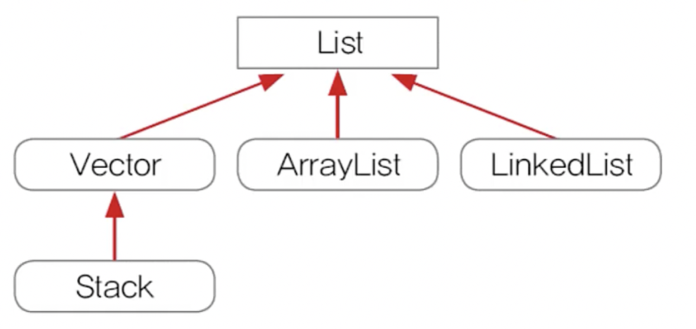
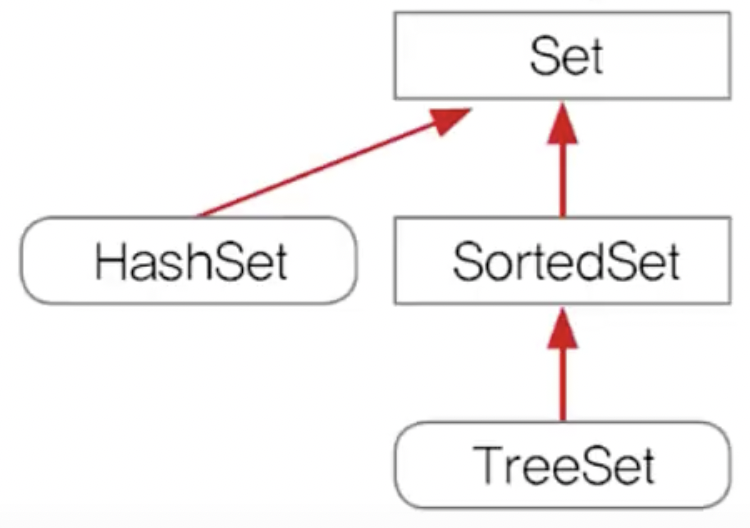
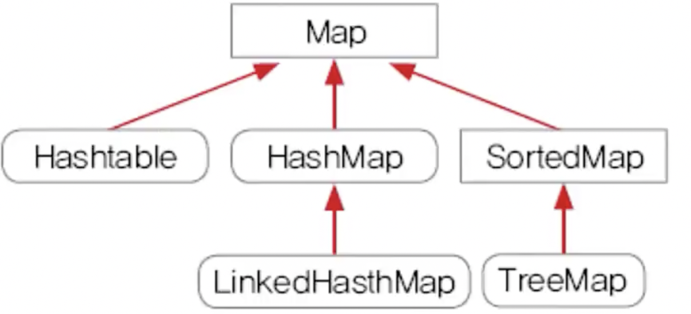
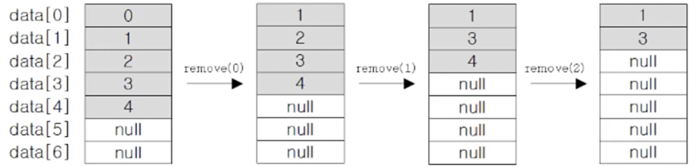
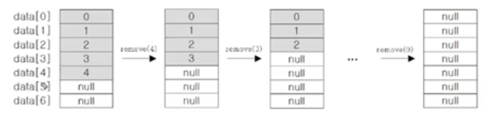
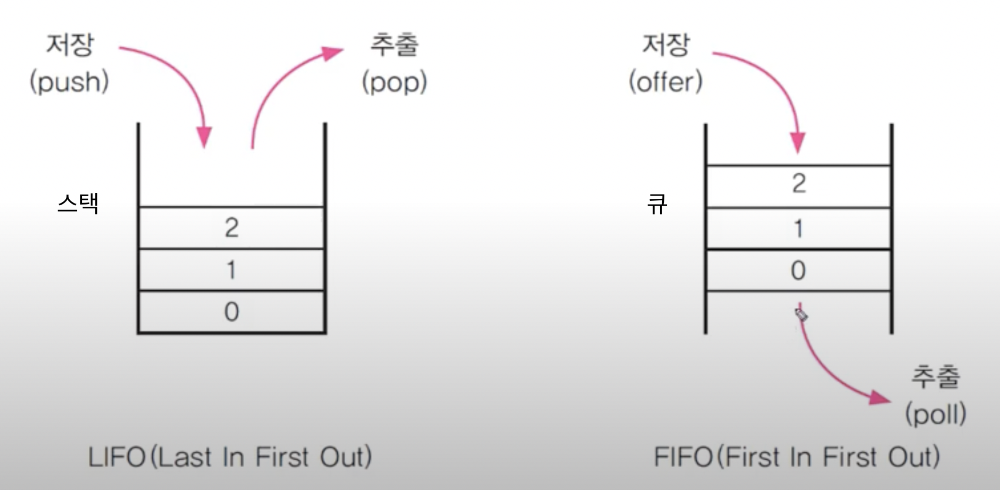
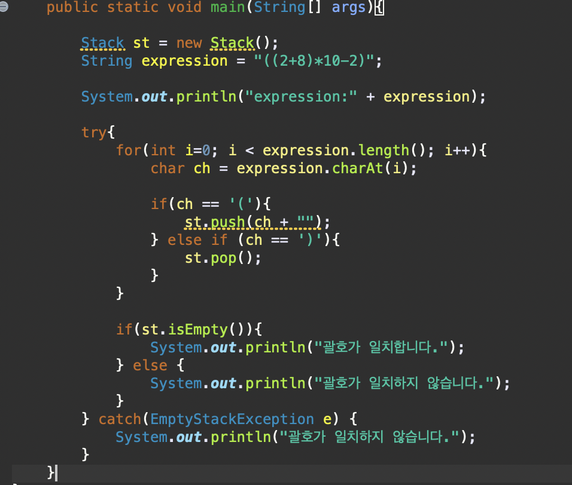
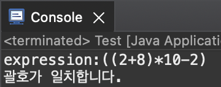
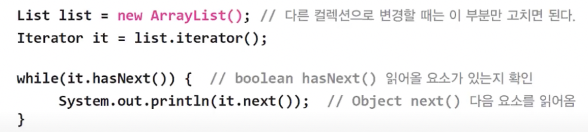

# Chapter 11 컬렉션 프레임웍

```
컬렉션(collection)
- 여러 객체(데이터)를 모아 놓은 것을 의미

프레임웍(framework)
- 표준화, 정형화된 체계적인 프로그래밍 방식

컬렉션 프레임웍(collection framework)
- 컬렉션(다수의 객체)을 다루기 위한 표준화된 프로그래밍 방식
- 컬렉션을 쉽고 편리하게 다룰 수 있는 다양한 클래스를 제공
- java.util패키지에 포함, JDK1.2부터 제공

컬렉션 클래스(collection class)
- 다수의 데이터를 저장할 수 있는 클래스 ex) ArrayList, HashSet
```

|인터페이스|설명|
|-----------------|------|
|List|순서가 있는 데이터의 집합, 중복 허용, 구현클래스: ArrayList, LinkdedList 등
|Set|순서를 유지하지 않는 데이터의 집합, 중복 허용 X, 구현클래스: HashSet, TreeSet 등
|Map|키와 값의 쌍으로 이어어진 데이터 집합, 순서 유지하지 않고, 키는 중복 허용 X, 값은 중복 허용 ex) HashMap, TreeMap 등

<br /><br />

## Collection 인터페이스의 메서드
<br />
 
|메서드|설명|
|-----------------|-----------------------|
|boolean add(Object o)<br/>boolean addAll(Collection c)|지정된 객체(o) 또는 Collection(c)의 객체들을 Collection에 추가한다.
|void clear()|Collection의 모든 객체를 삭제한다.
|boolean contains(Object o)<br/>boolean containsAll(Collection c)|지정된 객체(o) 또는 Collection(c)의 객체들을 Collection에 포함되어 있는지 확인한다.
|boolean equals(Object o)|동일한 Collection인지 비교한다.
|int hashCode()|Collection의 hash code를 반환한다.
|boolean isEmpty()|Collection이 비어있는지 확인한다.
|lterator iterator()|Collection의 lteraior를 얻어서 반환한다.
|boolean remove(Object o)|지정된 객체를 삭제한다.
|boolean removeAll(Collection c)|지정된 Collection에 포함된 객체들을 삭제한다.
|boolean retainAll(Collection c)|지정된 Collection에 포함된 객체만을 남기고 다른 객체들은 Collection에서 삭제한다. 이 작업으로 인해 Collection에 변화가 있으면 true를 그렇지 않으면 false를 반환한다.
|int size()|Collection에 저장된 객체의 개수를 반환한다.
|Object[] toArray() |Collection에 저장된 객체를 객체배열(Object[])로 반환한다.
|Object[] toArray()(Object[] a) |지정된 배열에 Collection의 객체를 저장해서 반환한다.

<br /><br />

## List인터페이스 - 순서O, 중복O


<br/>

|메서드|설명|
|-----------------|-----------------------|
|void add(int index, Object element)<br/>boolean addAll(int index, Collection c)|지정된 위치(index)에 객체(element) 또는 컬렉션에 포함된 객체들을 추가한다.
|Object get(int index)|지정된 위치(index)에 있는 객체를 반환한다.
|int indexOf(Object o)|지정된 객체의 위치(index)를 반환한다.(List의 첫번째 요소로부터 순방향으로 찾는다.)
|int lastIndexOf(Object o)|지정된 객체의 위치(index)를 반환한다.(List의 마지막 요소로부터 역방향으로 찾는다.)
|Listlterator listlterator()<br/>Listlterator listlterator(int index)|List의 객체에 접근할 수 있는 Listlterator를 반환한다.
|Object remove(int index)|지정된 위치(index)에 있는 객체를 삭제하고, 삭제된 객체를 반환한다.
|Object set(int index, Object element)|지정된 위치(index)에 있는 객체(element)를 저장한다.
|void sort(Comparator c)|지정된 비교자(comparator)로 List를 정렬한다.
|List subList(int fromIndex, int toIndex)|지정된 범위(fromIndex부터 toIndex)에 있는 객체를 반환한다.

<br /><br />

## Set인터페이스 - 순서X, 중복X


<br/>

Set인터페이스의 메서드 - Collection인터페이스와 동일 <br />
집합과 관련된 메서드(Collection 변화가 있으면 true, 아니면 false를 반환)

<br />

|메서드|설명|
|-----------------|-----------------------|
|boolean addAll(Collection c|지정된 Collection(c)의 객체들을 Collection에 추가한다(합집합)
|boolean containsAll(Collection c|지정된 Collection의 객체들이 Collection에 포함되어 있는지 확인한다(부분집합)
|boolean removeAll(Collection c|지정된 Collection에 포함된 객체들을 삭제한다.(차집합)
|boolean retainAll(Collection c|지정된 Collection에 포함된 객체만을 남기고 나머지는 Collection에서 삭제한다.(교집합)

<br/><br/>

## Map인터페이스 - 순서X, 중복(키X,값O)


<br />

|메서드|설명|
|-----------------|-----------------------|
|void clear()|Map의 모든 객체를 삭제한다.
|boolean containsKey(Object key)|지정된 Key객체와 일치하는 Map의 key객체가 있는지 확인한다.
|boolean containsValue(Object value)|지정된 value객체와 일치하는 Map의 value객체가 있는지 확인한다.
|Set entrySet()|Map에 저장되어 있는 key-value쌍을 Map.Entry타입의 객체로 저장한 Set으로 반환한다.
|boolean equals(Object o)|동일한 Map인지 비교한다.
|Object get(Object key)|지정한 key객체에 대응하는 value객체를 찾아서 반환한다.
|int hashCode()|해시코드를 반환한다.
|boolean isEmpty()|Map이 비어있는지 확인한다.
|Set keySet()|Map에 저장된 모든 key객체를 반환한다.
|Object put(Object key, Object value)|Map에 value객체를 key객체에 연결(mapping)하여 저장한다.
|void putAll(Map t)|지정된 Map의 모든 key-value쌍을 추가한다.
|Object remove(Object key)|지정된 key객체와 일치하는 key-value객체를 삭제한다.
|int size()|Map에 저장한 key-value쌍의 개수를 반환한다.
Collection values()|Map에 저장된 모든 value객체를 반환한다.

<br /><br/>

## ArrayList
- ArrayList는 기존의 Vector를 개선한 것으로 구현원리와 기능적으로 동일
- ArrayList와 달리 Vector는 자체적으로 동기화처리가 되어있다.
- 데이터 저장공간으로 배열을 사용한다.
- List인터페이스를 구현하므로, 저장순서 유지, 중복 허용
- 객체를 중간 삭제하거나 추가시, 뒤에 있는 데이터들을 다 앞으로 땡겨오거나, 뒤로 미룸!

<br/>

### ArrayList에 저장된 객체의 삭제과정
#### 1. ArrayList에 저장된 첫 번째 객체부터 삭제하는 경우(배열 복사 발생)
```java
for(int i=0; i <list.size(); i++;){
    list.remove(i);
}
```


→ for문 다 돌았는데도, 값 남아있을 수 있음! why? 삭제할때마다 값이 올라가기 때문(앞으로 땡겨져서) 그래서 마지막 객체부터 삭제하면 됨

<br/>

#### 2. ArrayList에 저장된 마지작 객체부터 삭제하는 경우(배열 복사 발생안함)
```java
for(int i=list.size()-1; i >=0; i--;){
    list.remove(i);
}
```


## LinkedList
- 배열의 장점: 구조가 간단하고, 데이터를 읽는데 걸리는 시간(접근시간, access time)이 짧다.
- 단점: 크기를 변경할 수 없다.
크기를 변경해야 하는 경우 새로운 배열을 생성 후 데이터를 복사해야함, 그리고 참조변경, 크기 변경을 피하기 위해 충분히 큰 배열을 생성하면, 메모리가 낭비됨
- 단점: 비순차적인 데이터의 추가, 삭제에 시간이 많이 걸린다.
(데이터를 추가하거나 삭제하기 위해, 다른 데이터를 옮겨야 함
but 순차적인 데이터 추가(끝에 추가)와 삭제(끝부터 삭제)는 빠르다.)

### 배열의 단점을 보완하기 위해 나온게 LinkedList
- 배열과 달리 불연속적으로 존재하는 데이터를 연결(link)
- 데이터 삭제 : 단 한번의 참조 변경만으로 가능
- 노드로 연결, 노드에는 데이터와 다음요소에 대한 정보를 담고있음
- 데이터 추가: 한번의 Node객체생성과 두번의 참조 변경만으로 가능

but LinkdedList에도 단점이 있음!
- 데이터 접근성이 나쁨
=> 보완하기 위해 doubly linked list(더블리 링크드 리스트)- 이중 연결리스트, 접근성 향상, 노드에 다음요소, 이전요소의 정보를 담고있음
=> doubly circular linked list(더블리 써쿨러 링크드 리스트)- 이중 원형 연결리스트 라는 것도 있음
맨 앞 노드가 맨뒤의 요소를, 맨 뒤의 노드가 맨 앞의 요소를 가지고 있음

## ArrayList(배열기반) vs LinkedList(연결기반) 성능비교
1. 순차적으로 데이터를 추가/삭제 - ArrayList가 빠름
2. 비순차적으로 데이터를 추가/삭제 - LinkedList가 빠름
3. 접근시간(access time) - ArrayList가 빠름


<br /><br /><br />

## 스택과 큐(Stack & Queue)
- 스택: LIFO(Last In First Out)구조, 마지막에 저장된 것을 제일 먼저 꺼내게 된, 밑이 막힌 상자, 스택은 배열로 구현하면 좋고
Stack st = new Stack();으로 사용 가능

- 큐: FIFO구조, 제일 먼저 저장한 것을 제일 먼저 꺼내게 된다, 양끝이 뚫린 상자  ex) 줄서기, 링크드리스트 적합
Queue는 자바에서 인터페이스로 정의되어있기때문에 Queue q = new Queue(); 이렇게 할수 없음
인터페이스는 객체 생성 불가
그래서 어떻게?
1. Queue를 직접 구현
2. Queue를 구현한 클래스를 사용

Java API에서 찾아보면 2번의 목록이 있음
2번의 하나로 LinkedList가 있음

Queue g = new LinkedList(); 이렇게



## 스택과 큐의 활용
스택활용의 예 - 수식계산, 수식괄호 검사, 위드프로세서의 undo/redo, 웹브라우저의 뒤로/앞으로
큐의 활용 예 - 최근사용문서, 인쇄작업 대기목록, 버퍼

<br />

스택활용의 예 중 수식괄호 확인



## lterator, Listlterator, Enumeration
- 컬렉션에 저장된 데이터를 접근하는 사용되는 인터페이스

|메서드|설명|
|-----------------|-----------------------|
|boolean hasNext()|읽어 올 요소가 남아있는지 확인한다. 있으면 true, 없으면 false를 반환한다.
|Object next()|다음 요소를 읽엉온다. next()호출하기 전에 hasNext()를 호출해서 읽어 올 요소가 있는지 확인하는 것이 안전하다.

<br />

- Enumeration은 lterator의 구버전
- Listlterator는 lterator의 접근성을 향상시킨 것(단방향 -> 양방향)
- 컬렉션에 저장된 요소들을 읽어오는 방법을 표준화한 것
ex) 리스트를 쓰다가 set으로 바꿨어, 그러면 둘의 구조가 다르니까
저장되어 있는 요소를 읽어오는 코드가 다름, lterator쓰면 읽어오는 코드를 바꿀필요 없음
- 컬렉션에 iterator()를 호출해서 lterator를 구현한 객체를 얻어서 사용



<br /> 

- iterator는 1회용이라 다 쓰면 나면 다시 객체를 얻어와야함
- Map에는 iterator()가 없다!
- iterator()는 collection에 정의되어있는데, Map은 collection의 자손이 아니기 떄문에!
- 따라서 keySet(), entrySet(), values()를 호출해서 iterator()사용
```java
Map map = new HashMap();

Iterator it = map.entrySet().iterator();
```
<br /> 

## Arrays
1.배열의 출력 - toString()<br/>
2.배열의 복사 - copyOf(), copyOfRange() : 새로운 배열 생성해서 반환 <br/>
3.배열 채우기 - fill(), setAll() <br/>
4.배열의 정렬과 검색 - sort(), binarySearch() : 이진탐색은 정렬되어있을때만 가능 <br/>
5.다차원 배열의 출력 - deepToString() <br/>
6.다차원 배열의 비교 - deepEquals() <br/>
7.배열을 List로 변환 - asList(Object.. a) : 읽기전용 <br/>
8.람다와 스트림(14장) 관련 - parallelXXX(), spliterator(), stream()

## Comparator와 Comparable
: 객체 정렬에 필요한 메서드(정렬기준 제공)를 정의한 인터페이스
```
Comparable 기본 정렬기준으로 구현하는데 사용, compareTo로 비교, 객체를 나 자신과 비교

Comparator 기본 정렬기준 외에 다른 기준으로 정렬하고자 할 떄 사용, compare로 비교, 객체1,2비교
```

sort 정렬!
1. 두대상 비교
2. 자리 바꿈

Comparable(), Comparator()는 두 객체의 비교결과를 반환하도록 작성
같으면 0, 오른쪽이 크면 음수(-), 작으면 양수(+)
CompareTo() * -1 // -1을 곱해서 기본 정렬방식의 역으로 변경한다.

<br/><br/>

## HashSet - 순서 X, 중복 X
### HashSet
- Set인터페이스를 구현한 대표적인 컬력센 클래스
- 순서를 유지하려면, LinkedHashSet클래스를 사용하면 된다
### TreeSet
- 범위 검색과 정렬에 유리한 컬렉션 클래스
- HashSet보다 데이터 추가, 삭제에 시간이 더 걸림

* Set은 정렬 불가, sort써도 안됨, sort는 ()안에 List가 와야함
그래서 Set을 List를 옮기고, sort해야함

```
List list = new LinkedList(set);
Collections.sort(list);
System.out.println(list);
```

* HashSet은 객체를 저장하기 전에 기존에 같은 객체가 있는지 확인, 같은 객체가 없으면 저장하고, 있으면 저장하지 않는다.
* boolan add(Object o)는 저장할 객체의 equals()와 hashCode()를 호출

<br/><br/>

## TreeSet : 범위 탐색, 정렬
-> 정렬 필요 없음

<br/>
### 이진 탐색 트리(binary search tree)
: 부모보다 작은 값을 왼쪽, 큰 값을 오른쪽에 저장
: 데이터가 많아질수록 추가, 삭제에 시간이 더 걸림(비교 횟수 증가) <br/>

*HashSet은 equals(), hashCode()로 비교, TreeSet은 compare()를 호출해서 비교

<br/>

## TreeSet - 주요 생성자와 메서드
*여기서는 add(), remove(), size(), isEmpty() 등등은 제외

|메서드|설명|
|-----------------|-----------------------|
|TreeSet()|기본생성자
|TreeSet(Collection c)|주어진 컬렉션을 저장하는 TreeSet을 생성
|TreeSet(Comparator comp)|주어진 정렬기준으로 정렬하는 TreeSet을 생성
|Object first()|정렬된 순서에서 첫번째 객체를 반환한다
|Object last()|정렬된 순서에서 마지막 객체를 반환한다
|Object ceiling(Object o)|지정된 객체와 같은 객체를 반환, 없으면 큰 값을 가진 객체 중 제일 가까운 값의 객체를 반환, 없으면 null
|Object floor(Object o)|지정된 객체와 같은 객체를 반환, 없으면 작은 값을 가진 객체 중 제일 가까운 값의 객체를 반환, 없으면 null
|Object higher(Object o)|지정된 객체보다 값을 가진 객체 중 제일 가까운 값의 객체를 반환, 없으면 null
|Object lower(Object o)|지정된 객체보다 작은 값을 가진 객체 중 제일 가까운 값의 객체를 반환, 없으면 null
SortedSet SubSet(Object fromElement, Object toElement)|범위 검색(fromElement와 toElement사이)의 결과를 반환한다.(끝 범위인 toElement는 범위에 포함되지 않음)
SortedSet headSet(Object toElement)|지정된 객체보다 작은 값읠 객체들을 반환한다.
SortedSet tailSet(Object toElement)|지정된 객체보다 큰 값의 객체들을 반환한다.

<br /><br />

*TreeSet 범위검색에 유리! => subSet() 사용 
*headSet(), tailSet(), subSet()등은 TreeSet의 메소드이기때문에 TreeSet객체 생성시,
Set으로 객체생성하면 오류
```
Tree set = new TreeSet(); (O)
Set set = new TreeSet(); (X)

```
<br />

### 트리 순회
: 이진 트리의 모든 노드를 한번씩 읽는 것을 트리 순회라 한다.
: 전위, 중위, 후휘 순회법이 있으며, 중위 순회를 하면 오름차순으 정렬된다


<br/><br/>

## HashMap과 Hashtable - 순서X, 중복(키X, 값O)
-Map인터페이스를 구현, 데이터를 키와 값의 쌍으로 저장
-Hashtable 동기화, HashMap은 비동기화, 쓰레드에서 자세히 

### HashMap
-Map인터페이스를 구현한 대표적인 컬렉션 클래스
-순서를 유지하려면 LinkedHashMap클래스 사용하면 된다.

### TreeMap
-TreeSet이 TreeMap을 가지고 만듬
-범위 검색과 정렬에 유리한 컬렉션 클래스
-HashMap보다 데이터 추가, 삭제에 시간이 더 걸림

### HashMap의 키(key)와 값(value)
-해싱(hashing)기법으로 데이터를 저장, 데이터가 많아도 검색이 빠르다.
-Map인터페이스르 구현, 데이터를 키와 값의 쌍으로 저장


